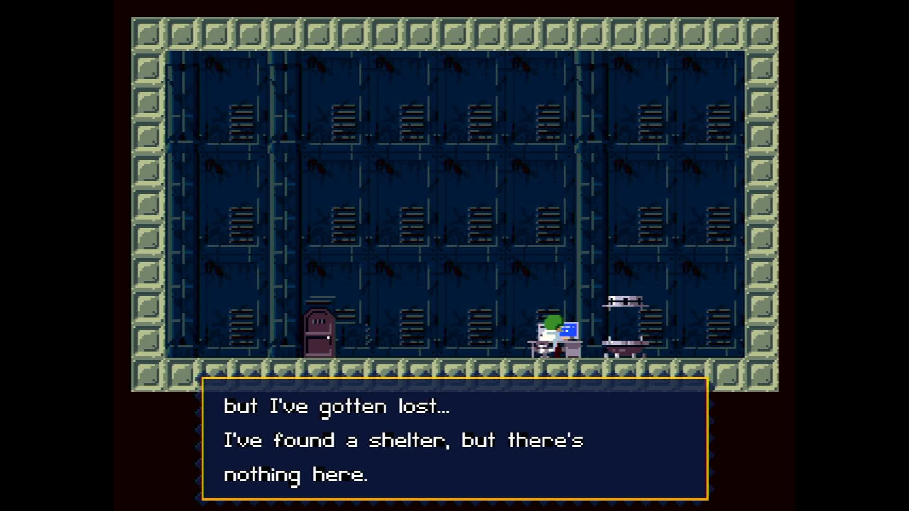

# pi-nxengine-evo

**NXEngine-evo — the Cave Story engine — running directly on a Raspberry Pi
with no operating system.** The board powers on and the game is what boots: no
Linux, no desktop, no launcher, and nothing else running beside it.

It builds for the Raspberry Pi 3, Pi 4 and Pi 5, all three from one source
tree.



*Captured from the Pi 5's HDMI output. The board is running this image and
nothing else — no kernel underneath it, no window system, no launcher.*

## What this is

[NXEngine-evo](https://github.com/nxengine/nxengine-evo) is an ordinary SDL2
application. This repository is the thin layer that lets it run with nothing
underneath: a [Circle](https://github.com/rsta2/circle) kernel that brings the
board up, and [circle-libsdl2](https://github.com/Xalior/circle-libsdl2), an
SDL2 implementation built on Circle's bare-metal drivers.

The game's own source is not copied or modified here. It is a submodule,
pinned at an upstream commit, and the build reads it without ever writing to
it. Everything the engine needs that the SDL2 layer does not already provide
is added beside it, in `host/`.

The game draws at its own resolution and the picture is scaled once onto
whatever your screen actually is.

## What works

Cave Story plays, with the Organya soundtrack the engine synthesises itself.

- **Picture and sound.** The game and its original music.
- **Keyboard and game controllers.** Both.
- **Saved games and settings.** Written back to the SD card.

What is missing:

- **The replacement Ogg soundtracks.** Choosing one of those music
  directories in the options leaves the game silent. The original Organya
  soundtrack is the one that plays.
- **Screenshots.** The screenshot key cannot write a file out.
- **Rumble.** Force feedback on a controller does nothing.

## Building

You need a Linux or macOS machine, GNU make, and the Arm GNU toolchain for
`aarch64-none-elf` (release 15.2.Rel1). Put its `bin` directory on your `PATH`,
or unpack it into `toolchains/` in this repository.

```sh
git clone --recursive https://github.com/Xalior/pi-nxengine-evo.git
cd pi-nxengine-evo
make deps       # long: builds newlib and libc++ from source, once per board
make kernels    # the three board images
make verify     # confirms each image exists and is not empty
```

`make deps` is the slow step, and it is slow once. It builds a complete C and
C++ world for each board, because each board's world is compiled for its own
processor.

The images land in `host/build/<board>/`:

| Board | Image |
|---|---|
| Pi 3 | `host/build/rpi3/kernel8.img` |
| Pi 4 | `host/build/rpi4/kernel8-rpi4.img` |
| Pi 5 | `host/build/rpi5/kernel_2712.img` |

## Putting it on a card

```sh
make card
```

That builds the card into `build/sd-card/` for you to copy onto FAT32 media.
It fetches the Raspberry Pi firmware at the revision Circle is built against
and checks every file against a hash, stages the three kernel images under the
names each board's firmware looks for, writes the boot configuration, and
copies the engine's own `data/` directory out of the upstream checkout. Given
a mounted FAT32 volume instead, `tools/mkcard /Volumes/YOUR-CARD` writes
straight to it.

The same repository state always produces the same card, and the script ends
by reading back what actually landed rather than trusting that the copies
worked.

The card ends up laid out like this:

| On the card | What it is |
|---|---|
| `config.txt`, `cmdline.txt` | boot configuration, read by the firmware |
| `kernel8.img`, `kernel8-rpi4.img`, `kernel_2712.img` | one image per board; the firmware picks its own |
| `data/` | everything the engine reads |
| `nxengine/` | settings, saved games and the log — created on the first run |

## The game's data files, which you must supply

**Cave Story's own files are not in this repository and are not on the card
the build makes.** They belong to the game's author, Daisuke "Pixel" Amaya,
and are not this project's to distribute. Without them the engine starts and
then stops, because there is no game to load.

They come out of the original freeware release of Cave Story, which Pixel
published at no charge and which is still distributed at no charge. Two
places to get it:

- **[The Cave Story Tribute Site](https://www.cavestory.org/)** — the
  long-running community site, which hosts the original Japanese release and
  the English translation by Aeon Genesis.
- **The Internet Archive**, which keeps copies of the same original release.

Do not use a purchased version. *Cave Story+* and the other paid re-releases
are separate commercial products with different data, and taking files out of
one is neither necessary nor permitted.

The engine does not read the original files directly. It reads files that
`nxextract` — a small program that is part of NXEngine-evo — produces from
`Doukutsu.exe`. Build and run that on your desktop machine, following
[NXEngine-evo's own build instructions](https://github.com/nxengine/nxengine-evo/wiki),
in the directory holding your copy of Cave Story. It writes a `data/`
directory. Copy the contents of that directory into the card's `data/`
directory, beside the files `make card` already put there.

## Keeping it cool

The card carries `cmdline.txt`, which sets the temperature the board is
allowed to reach and the pin its fan is on:

    socmaxtemp=70 gpiofanpin=45

Pin 45 is the Raspberry Pi 5 Case Fan and Active Cooler. With a fan named,
reaching 70°C switches the fan on and the processor keeps running at full
speed. Without one it would be slowed down instead, and a slowed processor
drops frames.

If your fan is wired somewhere else, change the pin number.

## License

The code in this repository — the kernel layer in `host/` and the build — is
released under the GNU Lesser General Public License, version 3. See
[LICENSE](LICENSE).

The submodules are other people's work and carry their own terms, and two of
them matter before you distribute anything you build here:

- **NXEngine-evo** is released under the GNU General Public License, version 3.
- **Circle** is released under the GNU General Public License, version 3.

Building a kernel image here combines them, so the image is covered by the GNU
General Public License, version 3. Doing that for yourself is straightforward;
redistributing the result means satisfying those terms, which among other
things means offering the complete corresponding source.

Cave Story is the work of Daisuke "Pixel" Amaya. This project is not
affiliated with him, with Nicalis, or with any publisher of the game.
